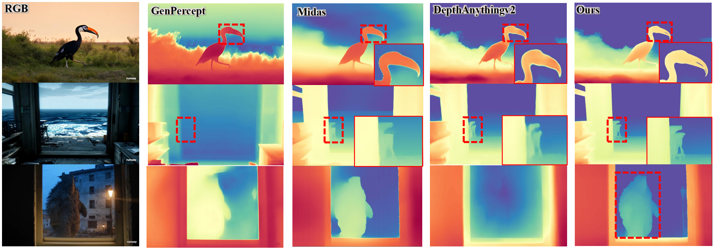

<div align="center">
<h1>Distill Any Depth: 
  Distillation Creates a Stronger Monocular Depth Estimator
</h1>
  
[**Xiankang He**](https://github.com/shuiyued)<sup>1*,2</sup> · [**Dongyan Guo**](https://homepage.zjut.edu.cn/gdy/)<sup>1*</sup> · [**Hongji Li**]()<sup>2,3</sup>
  <br>
[**Ruibo Li**]()<sup>4</sup> · [**Ying Cui**](https://homepage.zjut.edu.cn/cuiying/)<sup>1</sup> · [**Chi Zhang**](https://icoz69.github.io/)<sup>2✉</sup> 

<sup>1</sup>ZJUT&emsp;&emsp;&emsp;<sup>2</sup>WestLake University&emsp;&emsp;&emsp;<sup>3</sup>LZU&emsp;&emsp;&emsp;<sup>4</sup>NTU
<br>
✉ Corresponding author
<br>
*Equal Contribution. This work was done while Xiankang He was visiting Westlake University.

<a href="http://arxiv.org/abs/2502.19204"></a>
<a href='https://distill-any-depth-official.github.io'></a>
<a href='https://huggingface.co/spaces/xingyang1/Distill-Any-Depth'></a>

[](https://paperswithcode.com/sota/monocular-depth-estimation-on-eth3d?p=distill-any-depth-distillation-creates-a)
[](https://paperswithcode.com/sota/depth-estimation-on-scannetv2?p=distill-any-depth-distillation-creates-a)
[](https://paperswithcode.com/sota/monocular-depth-estimation-on-nyu-depth-v2?p=distill-any-depth-distillation-creates-a)

</div>


We present Distill-Any-Depth, a new SOTA monocular depth estimation model trained with our proposed knowledge distillation algorithms. Models with various seizes are available in this repo.


## News
- **2025-03-02:🔥🔥🔥** Our demo is updated to GPU version. Enjoy it! We also include the Gradio demo code in this repo.
- **2025-02-26:🔥🔥🔥** Paper, project page, code, models, and demos are  released.

## TODO
- Release training code.
- Release additional models in various sizes.

## Pre-trained Models

We provide **two models** of varying scales for robust relative depth estimation:

| Model | Architecture | Params | Checkpoint |
|:-|:-:|:-:|:-:|
| Distill-Any-Depth-Multi-Teacher-Base | Dav2-base | 97.5M | [Download](https://huggingface.co/xingyang1/Distill-Any-Depth/resolve/main/base/model.safetensors?download=true) |
| Distill-Any-Depth-Multi-Teacher-Large | Dav2-large | 335.3M | [Download](https://huggingface.co/xingyang1/Distill-Any-Depth/resolve/main/large/model.safetensors?download=true) |

## Getting Started

We recommend setting up a virtual environment to ensure package compatibility. You can use miniconda to set up the environment. The following steps show how to create and activate the environment, and install dependencies:

```bash
# Create a new conda environment with Python 3.10
conda create -n distill-any-depth -y python=3.10

# Activate the created environment
conda activate distill-any-depth

# Install the required Python packages
pip install -r requirements.txt

# Navigate to the Detectron2 directory and install it
cd detectron2
pip install -e .

cd ..
pip install -e .
```

To download pre-trained checkpoints follow the code snippet below:


### Running from commandline

We provide a helper script to run the model on a single image directly:
```bash
# Run prediction on a single image using the helper script
source scripts/00_infer.sh
or
bash scripts/00_infer.sh
```

```bash
# you should download the pretrained model and input the path on the '--checkpoint'

# Define the GPU ID and models you wish to run
GPU_ID=0
model_list=('xxx')  # List of models you want to test

# Loop through each model and run inference
for model in "${model_list[@]}"; do
    # Run the model inference with specified parameters
    CUDA_VISIBLE_DEVICES=${GPU_ID} \
    python tools/testers/infer.py \
        --seed 1234 \  # Set random seed for reproducibility
        --checkpoint 'checkpoint/large/model.safetensors' \  # Path to the pre-trained model checkpoint
        --processing_res 0 \ 
        --output_dir output/${model} \  # Directory to save the output results
        --arch_name 'depthanything-large' \  # [depthanything-large, depthanything-base]
done
```

## Gradio demo
We also include the Gradio demo code, Please clone the project and set up the environment using pip install.

```bash
# Create a new conda environment with Python 3.10
conda create -n distill-any-depth -y python=3.10

# Activate the created environment
conda activate distill-any-depth

# Install the required Python packages
pip install -r requirements.txt

pip install -e .
```
Make sure you can connect to Hugging Face, or use the local path. (app.py)
```bash
# if use hf_hub_download, you can use the following code
checkpoint_path = hf_hub_download(repo_id=f"xingyang1/Distill-Any-Depth", filename=f"large/model.safetensors", repo_type="model")

# if use local path, you can use the following code
# checkpoint_path = "path/to/your/model.safetensors"
```
in the end, 
```bash
python app.py

:~/Distill-Any-Depth-main# python app.py 
xFormers not available
xFormers not available
xFormers not available
xFormers not available
Running on local URL:  http://127.0.0.1:7860

To create a public link, set `share=True` in `launch()`.
IMPORTANT: You are using gradio version 4.36.0, however version 4.44.1 is available, please upgrade.
--------
```

## More Results




## Citation

If you find our work useful, please cite the following paper:

```bibtex
@article{he2025distill,
  title   = {Distill Any Depth: Distillation Creates a Stronger Monocular Depth Estimator},
  author  = {Xiankang He and Dongyan Guo and Hongji Li and Ruibo Li and Ying Cui and Chi Zhang},
  year    = {2025},
  journal = {arXiv preprint arXiv: 2502.19204}
}
```

## Related Projects

- [Depth Anything V2](https://github.com/DepthAnything/Depth-Anything-V2)
- [MiDaS](https://github.com/isl-org/MiDaS)
- [GenPercept](https://github.com/aim-uofa/GenPercept)
- [GeoBench: 3D Geometry Estimation Made Easy](https://github.com/aim-uofa/geobench)
- [HDN](https://github.com/icoz69/HDN)
- [Detectron2](https://github.com/facebookresearch/detectron2)


## License
This sample code is released under the MIT license. See [LICENSE](LICENSE) for more details.
